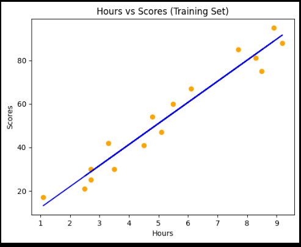
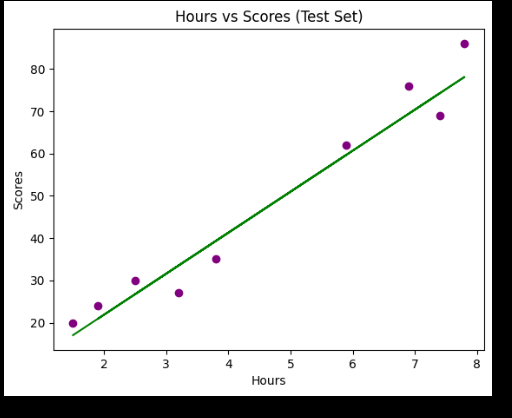
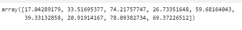
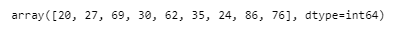
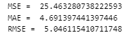

# Implementation-of-Simple-Linear-Regression-Model-for-Predicting-the-Marks-Scored

## AIM:
To write a program to predict the marks scored by a student using the simple linear regression model.

## Equipments Required:
1. Hardware – PCs
2. Anaconda – Python 3.7 Installation / Jupyter notebook

## Algorithm
1.To implement the linear regression using the standard libraries in the python.
2.Use slicing function() for the x,y values.
3.Using sklearn library import training , testing and linear regression modules.
4.Predict the value for the y.
5.Using matplotlib library plot the graphs.
6.Use xlabel for hours and ylabel for scores.
7.End the porgram.

## Program:
```
/*
Program to implement the simple linear regression model for predicting the marks scored.
Developed by: T Kirthi Niharika
RegisterNumber: 212221040084
*/
import pandas as pd
import numpy as np
import matplotlib.pyplot as plt
#import libraries to find mae, mse
from sklearn.metrics import mean_absolute_error, mean_squared_error
#read csv file
df=pd.read_csv('student_scores.csv')
#displaying the content in datafile
df.head()
df.tail()
# Segregating data to variables
X = df.iloc[:,:-1].values
X
Y = df.iloc[:,1].values
Y
#splitting train and test data
from sklearn.model_selection import train_test_split 
X_train,X_test, Y_train, Y_test=train_test_split(X, Y, test_size=1/3,random_state=0)
#import linear regression model and fit the model with the data
from sklearn.linear_model import LinearRegression
regressor=LinearRegression()
regressor.fit(X_train, Y_train)
Y_pred=regressor.predict(X_test)
#displaying predicted values
Y_pred
#displaying actual values
Y_test
#graph plot for training data
plt.scatter(X_train, Y_train, color="orange")
plt.plot(X_train, regressor.predict(X_train), color="blue")
plt.title("Hours vs Scores (Training Set)")
plt.xlabel("Hours")
plt.ylabel("Scores")
plt.show()
#graph plot for test data
plt.scatter(X_test, Y_test, color="purple")
plt.plot(X_test, regressor.predict(X_test), color="green")
plt.title("Hours vs Scores (Test Set)")
plt.xlabel("Hours")
plt.ylabel("Scores")
plt.show()
#find mae,mse,rmse
mse =  mean_squared_error(Y_test, Y_pred)
print('MSE = ',mse)
mae = mean_absolute_error(Y_test,Y_pred)
print('MAE = ',mae)
rmse = np.sqrt(mse)
print("RMSE = ",rmse)
```


## Output:


Prediction Values of Y

Test Value of Y

Values of MSE, MAE and RMSE

## Result:
Thus the program to implement the simple linear regression model for predicting the marks scored is written and verified using python programming.
